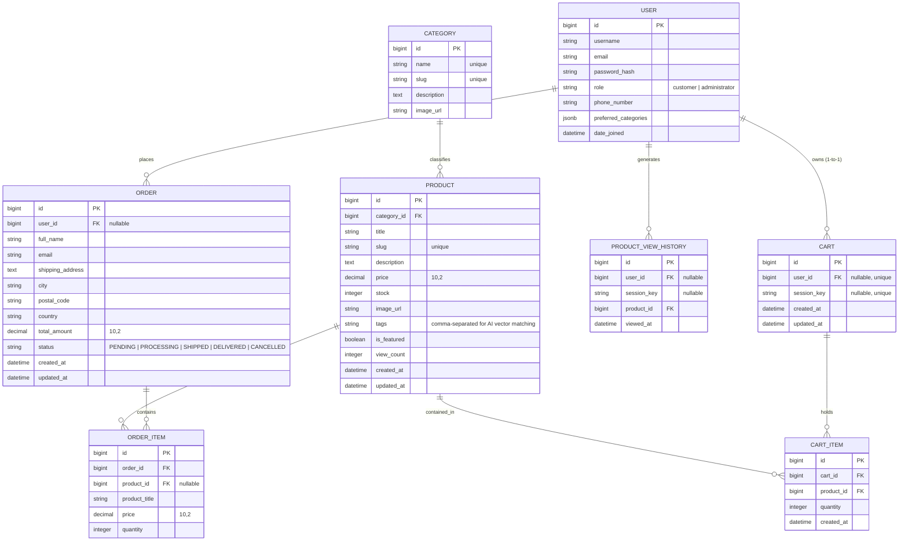

# Entity-Relationship (ER) Diagram
## AI-Powered E-Commerce System

Below is the complete database structure and relationships designed for PostgreSQL / Django ORM as specified in Section 3 and 6 of the SRS document.

## Detailed Entity Schema Specifications

### 1. `USER` (Table: `authentication_user`)
- Extends Django's `AbstractUser`.
- `role`: Enum `['customer', 'administrator']`. Controls view permissions and admin dashboard access.

### 2. `PRODUCT` (Table: `products_product`)
- Stores e-commerce inventory items.
- `tags`: Indexed string containing keyword tokens used by the AI TF-IDF Vectorizer to compute product similarity embeddings.
- `view_count`: Incremented on every detail view to calculate trending score metrics.

### 3. `PRODUCT_VIEW_HISTORY` (Table: `products_productviewhistory`)
- Tracks user/guest item view timestamps to feed the personalized AI recommendation engine.

### 4. `CART` & `CART_ITEM` (Tables: `cart_cart`, `cart_cartitem`)
- Supports both authenticated users and anonymous guest sessions via `session_key`.

### 5. `ORDER` & `ORDER_ITEM` (Tables: `orders_order`, `orders_orderitem`)
- Preserves price snapshots at checkout time.
